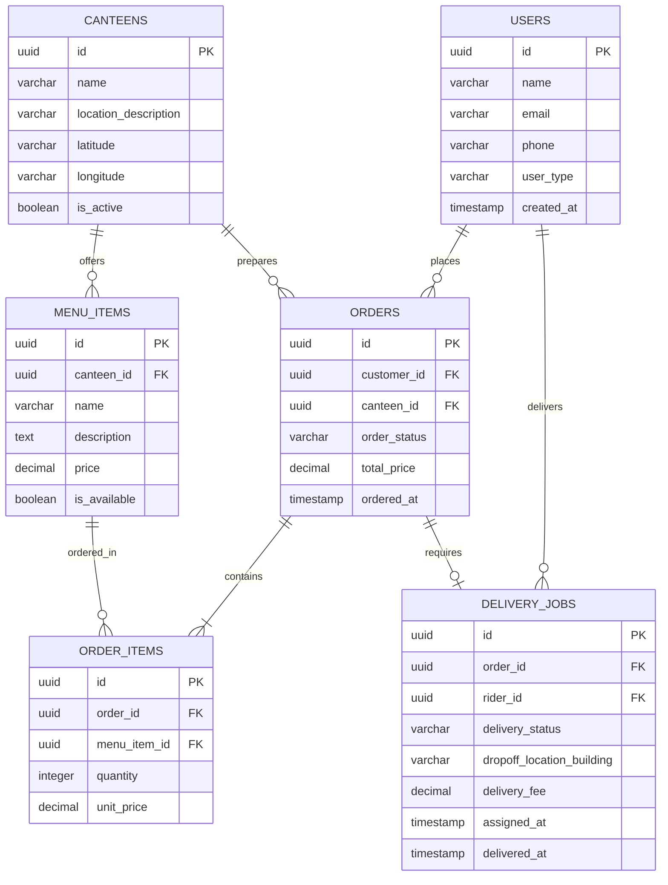

# CampusEats System Brief

CampusEats is an on-campus food ordering and delivery system. It allows university students and staff to order food from campus canteens, which is then delivered to classrooms, offices, or dorms by student riders.

---

## 👥 User Roles

- **Customers (Students/Staff)**: Browse canteens, customize menu items, place orders, make payments, and track delivery status.
- **Canteen Operators (Merchants)**: Manage menus, accept/decline orders, and update prep status.
- **Riders (Student Delivery)**: View delivery jobs, accept assignments, view delivery locations, and update drop-off milestones.
- **Platform Administrators**: Manage user accounts, canteen registrations, and resolve system issues.

---

## 🏗️ System Architecture

A standard microservices architecture manages the platform processes:

```
    [ Customer App ]      [ Merchant App ]      [ Rider App ]
           │                     │                     │
           ▼                     ▼                     ▼
    ┌────────────────────────────────────────────────────────┐
    │                      API Gateway                       │
    └───────────────────────────┬────────────────────────────┘
                                │
                 ┌──────────────┴──────────────┐
                 ▼                             ▼
       ┌───────────────────┐         ┌───────────────────┐
       │   REST Services   │         │  Real-Time Server │
       │ (Auth, Menu, Order)         │ (WebSocket/Redis) │
       └─────────┬─────────┘         └─────────┬─────────┘
                 │                             │
                 ▼                             ▼
       ┌───────────────────┐         ┌───────────────────┐
       │    PostgreSQL     │         │    Redis Cache    │
       │   (Primary DB)    │         │  (Live Tracking)  │
       └───────────────────┘         └───────────────────┘
```

---

## 📊 Database Schema (Entity Relationship Diagram)

Below is the entity relationship diagram for the CampusEats schema.



---

## 🔌 API Specifications

### 1. List Canteens
- **Protocol**: `GET /api/v1/canteens`
- **Response**: `200 OK`
- **Body**:
  ```json
  [
    {
      "id": "e30b3558-7264-4e2b-987a-624e4d41fa99",
      "name": "Central Food Court",
      "location_description": "Student Center, 1st Floor",
      "is_active": true
    }
  ]
  ```

### 2. Get Menu
- **Protocol**: `GET /api/v1/canteens/{canteen_id}/menu`
- **Response**: `200 OK`
- **Body**:
  ```json
  {
    "canteen_id": "e30b3558-7264-4e2b-987a-624e4d41fa99",
    "menu_items": [
      {
        "id": "18f9d023-fa58-450f-90e9-b5f76ee3b1a8",
        "name": "Classic Veg Burger",
        "price": 5.99,
        "is_available": true
      }
    ]
  }
  ```

### 3. Place Order
- **Protocol**: `POST /api/v1/orders`
- **Request Body**:
  ```json
  {
    "canteen_id": "e30b3558-7264-4e2b-987a-624e4d41fa99",
    "items": [
      {
        "menu_item_id": "18f9d023-fa58-450f-90e9-b5f76ee3b1a8",
        "quantity": 2
      }
    ],
    "dropoff_location_building": "Science Lab A"
  }
  ```
- **Response**: `201 Created`
- **Body**:
  ```json
  {
    "order_id": "99b0c79f-6821-4fa3-9e4a-43d99dcf5d1e",
    "order_status": "placed",
    "total_price": 11.98,
    "ordered_at": "2026-08-12T15:45:10Z"
  }
  ```
