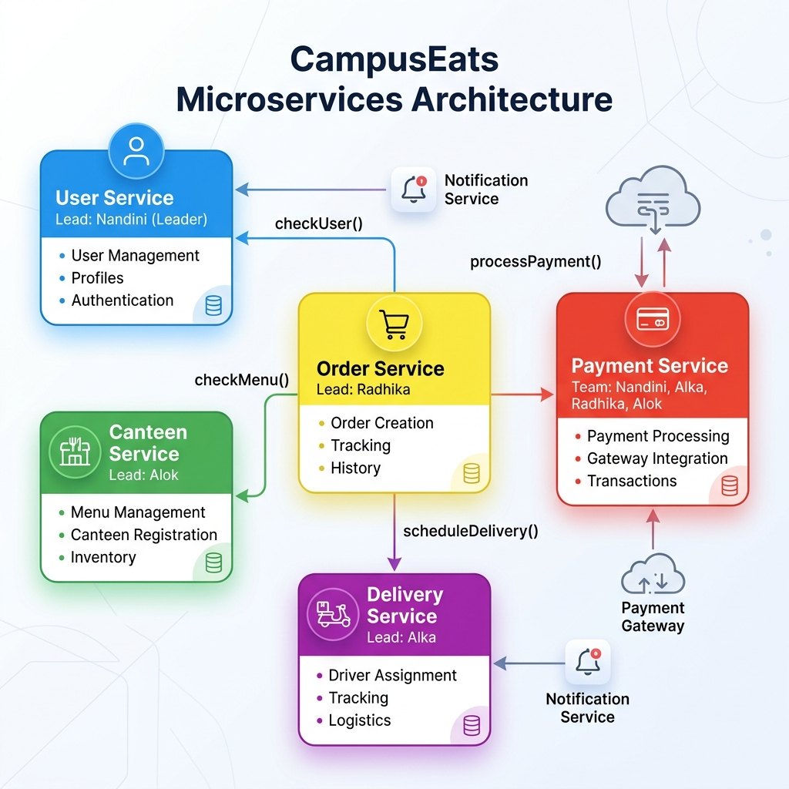
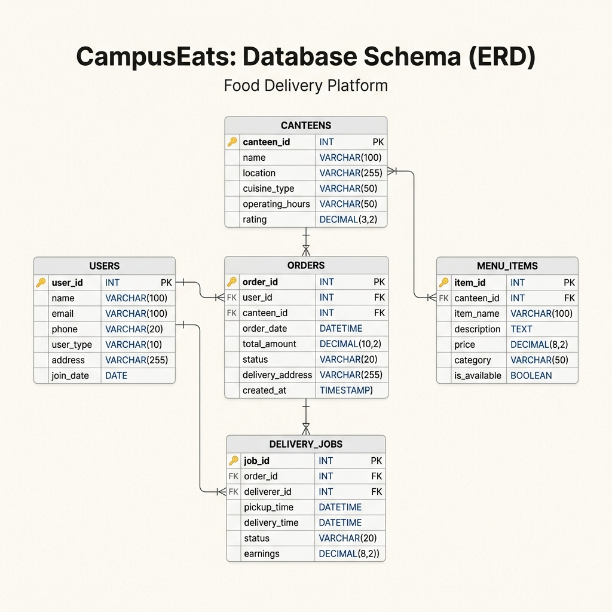

# CampusEats System Brief

CampusEats is an on-campus food ordering and delivery web application specifically tailored for university campuses. The platform enables students, faculty, and staff to order meals from campus canteens and cafes, with logistics fulfilled by student riders using eco-friendly transportation (walking, bicycles, or e-scooters) to deliver meals directly to classrooms, dormitories, and library study spaces.

---

## 👥 User Roles & Core Workflows

The platform serves four primary user roles, each interacting through custom views:

### 1. 🎓 Student/Staff (Customers)
* Browse list of participating campus canteens and filter by food type, wait time, or dietary restrictions (e.g., vegetarian, gluten-free).
* Build cart, customize ingredients (e.g., extra toppings), and checkout securely via campus card integration or digital wallets.
* Track order status (Placed ➔ Preparing ➔ Out for Delivery ➔ Arrived) in real-time.

### 2. 🍳 Canteen Operators (Merchants)
* Manage canteen profile, update operating hours, and toggle menu item availability dynamically.
* View and update incoming orders via a tablet dashboard.
* Update food preparation status (e.g., marking an order as "Ready for Pickup").

### 3. 🚲 Student Riders (Delivery Partners)
* View pool of available delivery jobs on campus, listing canteen pickup and classroom/dorm delivery coordinates.
* Accept jobs, navigate the campus, and update delivery status milestones.
* Track deliveries made, tips earned, and dynamic delivery fee payouts.

### 4. ⚙️ Platform Administrators
* Onboard new canteens, audit transactions, and manage user disputes.
* Monitor live system statistics (active orders, queue bottlenecks, driver density).

---

## 🏗️ System Architecture

CampusEats utilizes a modern, event-driven web services architecture designed to minimize latency and handle traffic surges during lunch and dinner hours.


*[Edit this diagram in Draw.io](services.drawio)*

* **Client Layer:** Modular web apps built with HTML5, modern CSS, and React, optimized for mobile responsiveness.
* **REST API Server:** Built using Spring Boot/Node.js to handle stateless HTTP operations (catalog browsing, user creation, order histories).
* **Real-time Services:** WebSocket nodes facilitating low-latency communication to push live coordinates of delivery riders to customers.
* **Cache & Message Broker:** Redis stores active delivery rider coordinates and handles pub/sub events for order state changes.
* **Primary Database:** PostgreSQL stores transactional, relational tables with PostGIS extensions to perform campus geofencing calculations (determining delivery routes and building boundaries).

---

## 📊 Database Schema (Entity Relationship Diagram)

Below is the entity schema for CampusEats. It outlines the normalized database architecture designed to maintain transaction integrity.


*[Edit this diagram in Draw.io](schema.drawio)*

---

## 🔌 Core REST API Specifications

The system exposes the following RESTful API endpoints for client integrations:

### 🍔 Canteen & Menu Endpoints

#### 1. List Active Canteens
* **Protocol:** `GET /api/v1/canteens`
* **Response Status:** `200 OK`
* **Response Payload:**
  ```json
  [
    {
      "id": "e30b3558-7264-4e2b-987a-624e4d41fa99",
      "name": "Central Food Court",
      "location_description": "Student Center, 1st Floor",
      "is_active": true
    }
  ]
  ```

#### 2. Get Canteen Menu
* **Protocol:** `GET /api/v1/canteens/{canteen_id}/menu`
* **Response Status:** `200 OK` / `404 Not Found`
* **Response Payload:**
  ```json
  {
    "canteen_id": "e30b3558-7264-4e2b-987a-624e4d41fa99",
    "canteen_name": "Central Food Court",
    "menu_items": [
      {
        "id": "18f9d023-fa58-450f-90e9-b5f76ee3b1a8",
        "name": "Classic Veg Burger",
        "price": 5.99,
        "is_available": true
      }
    ]
  }
  ```

### 🛒 Ordering Endpoints

#### 3. Place Order
* **Protocol:** `POST /api/v1/orders`
* **Request Payload:**
  ```json
  {
    "canteen_id": "e30b3558-7264-4e2b-987a-624e4d41fa99",
    "items": [
      {
        "menu_item_id": "18f9d023-fa58-450f-90e9-b5f76ee3b1a8",
        "quantity": 2
      }
    ],
    "dropoff_location_building": "Science Lab A"
  }
  ```
* **Response Status:** `201 Created` / `400 Bad Request`
* **Response Payload:**
  ```json
  {
    "order_id": "99b0c79f-6821-4fa3-9e4a-43d99dcf5d1e",
    "order_status": "placed",
    "total_price": 11.98,
    "ordered_at": "2026-08-12T15:45:10Z"
  }
  ```

#### 4. Update Delivery Job Status
* **Protocol:** `PATCH /api/v1/delivery-jobs/{job_id}/status`
* **Request Payload:**
  ```json
  {
    "status": "transit"
  }
  ```
* **Response Status:** `200 OK` / `403 Forbidden` / `404 Not Found`
* **Response Payload:**
  ```json
  {
    "job_id": "887fa541-11e2-45e3-99ab-6d88f619b0aa",
    "order_id": "99b0c79f-6821-4fa3-9e4a-43d99dcf5d1e",
    "rider_id": "43cfb439-d3ee-4db9-8b01-52316e6d1234",
    "delivery_status": "transit",
    "updated_at": "2026-08-12T15:52:12Z"
  }
  ```
